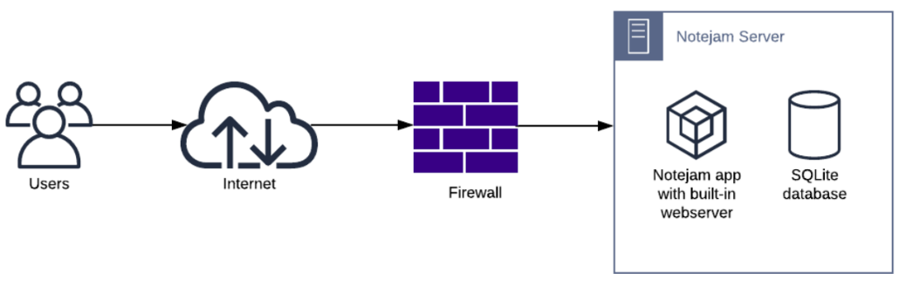
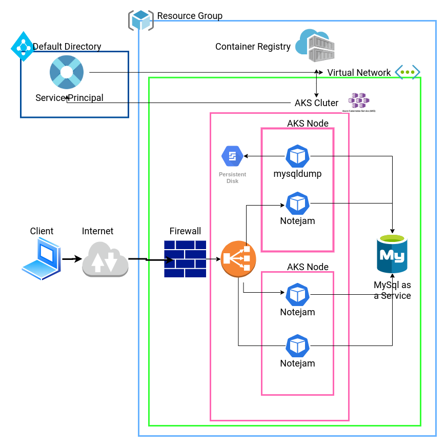

# Technical assessment for Nordcloud

## Summary
Regarding the [Bussiness Requirements](#business-requirements) I built a Azure managed Kubernetes cluster with a mysql as a service database. The `shell` folder contains the infrastucture deployemnt and application deployment codes. The `mysql` folder contains the app's mysql schema. The `helm` folder contains the kubernetized application. You can see the newly created infrastucture at section [Architecture](#architecture).

## Install

### Configuration
You can find configuration variables for the deployemnt in the file `shell/config.sh`.

### Requirements
You need install the next binaries:
- azure cli (ver2.11.1 or greater)
- kubectl (ver1.18 or greater)
- helm (ver3 or greater)
- jq (ver1.5.1 or greater)

### Install

```
cd shell
./main.sh
```

## Tear down
```
cd shell
./destroy.sh
```

### Connection via external IP address
The main script install the infrastucture and deploy the application. The result of the script will be a external IP address where you can reach the application.

### Connection via kubectl
You can port-forward the application to port `8080` with this command: `kubectl port-forward svc/notejam 8080:80`

## Business Requirements
- The Application must serve variable amount of traffic. Most users are active during business hours. During big events and conferences the  traffic could be 4 times more than typical.
- The Customer takes guarantee to preserve your notes up to 3 years and recover it if needed.
- The Customer ensures continuity in service in case of datacenter failures.
- The Service must be capable of being migrated to any regions supported by the cloud provider in case of emergency.
- The Customer is planning to have more than 100 developers to work in this project who want to roll out
multiple deployments a day without interruption / downtime.
- The Customer wants to provision separated environments to support their development process for development, testing, production in the near future
- The Customer wants to see relevant metrics and logs from the infrastructure for quality assurance and
security purposes.


## Architecture

### Current Architecutre
Notejam is currently build as monolith containing built-in webserver and SQLite database.



### New Architecture
